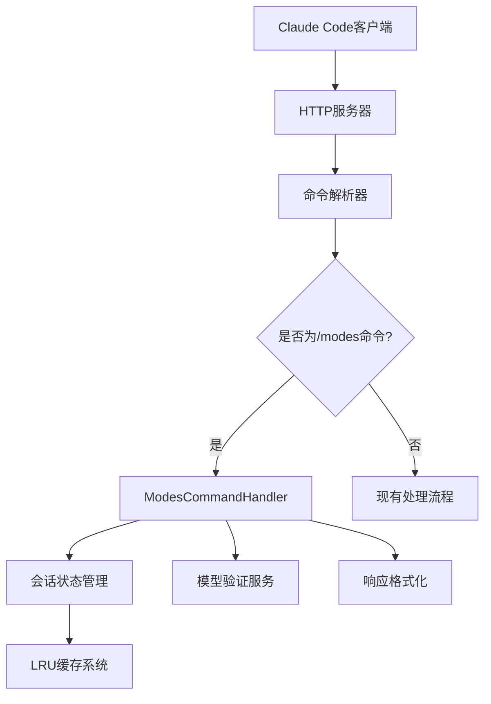

# /modes命令产品需求文档 (PRD)

## 📋 文档信息

- **文档版本**: 1.0
- **最后更新**: 2025-08-26
- **作者**: John (产品负责人)
- **状态**: 已批准

## 🎯 项目概述

### 项目背景
Claude Code Router用户在使用`ccr code`命令后，发现无法通过`/model`命令切换AI模型。虽然CLI命令`ccr mode provider,model`可以正常工作，但在Claude Code集成环境中需要一个独立的解决方案。

### 核心问题
1. `/model`命令在`ccr code`后无效
2. 缺乏会话级别的模型切换功能
3. 用户无法在不退出当前工作流的情况下快速切换模型

### 解决方案
引入新的`/modes`命令，专门用于Claude Code环境中的会话级模型切换，与现有CLI命令完全分离。

## 🎯 产品目标

### 主要目标
1. **实现会话级模型切换** - 用户可以在当前Claude Code会话中临时切换模型
2. **命令分离** - 与现有CLI和`/model`命令完全独立，避免冲突
3. **用户体验优化** - 提供直观、友好的命令交互体验

### 成功指标
- ✅ 用户可以在Claude Code中使用`/modes`命令切换模型
- ✅ 模型切换仅影响当前会话，不影响全局配置
- ✅ 命令响应时间小于200ms
- ✅ 90%+的测试覆盖率
- ✅ 用户满意度评分≥4.5/5.0

## 🎯 用户需求

### 用户画像
1. **开发者** - 需要在不同任务间快速切换模型
2. **技术写作者** - 需要使用不同模型生成技术内容
3. **数据分析师** - 需要根据不同任务选择合适的模型

### 用户旅程
```
1. 用户在Claude Code中工作
2. 需要切换到更适合当前任务的模型
3. 输入`/modes provider,model`命令
4. 系统确认模型切换成功
5. 继续当前工作，享受新模型带来的效果
6. 会话结束时，模型设置自动重置
```

### 痛点分析
- 缺乏快速模型切换机制
- 无法在工作流中临时尝试不同模型
- 需要退出当前会话才能更改模型配置

## 🎯 功能需求

### 核心功能

#### 1. 模型切换命令
```
命令格式: /modes provider,model
示例: /modes gemini,gemini-2.0-flash-exp
功能: 切换当前会话的AI模型
```

#### 2. 模型列表命令
```
命令格式: /modes --list
功能: 显示所有可用的模型列表
```

#### 3. 当前状态命令
```
命令格式: /modes --current
功能: 显示当前会话的模型状态
```

#### 4. 重置命令
```
命令格式: /modes --reset
功能: 将当前会话重置为默认模型
```

#### 5. 帮助命令
```
命令格式: /modes --help
功能: 显示命令帮助信息
```

### 非功能需求

#### 性能要求
- 单命令响应时间 < 200ms
- 并发处理能力 ≥ 100会话
- 内存使用稳定，无泄漏

#### 兼容性要求
- 与现有CLI命令完全兼容
- 不影响现有`/model`命令功能
- 支持所有已配置的模型提供商

#### 安全要求
- 严格的命令格式验证
- 会话隔离，确保用户数据安全
- 仅在Claude Code环境中可用

## 🎯 技术架构

### 系统设计


### 核心组件

#### 1. ModesCommandHandler
- 命令解析和验证
- 命令执行逻辑
- 响应格式化

#### 2. 会话状态管理
- 扩展SessionModelState接口
- 实现会话状态的存储和检索
- 支持临时模型切换标识

#### 3. 命令解析器扩展
- 集成到现有命令处理流程
- 识别和路由`/modes`命令

## 🎯 用户体验设计

### 响应格式标准

#### 成功响应
```
✅ 模型已切换
当前: gemini,gemini-2.0-flash-exp
原模型: deepseek,deepseek-chat
会话ID: claude-code-xxx
时间: 2025-01-26 15:30:25

💡 提示：
• 使用 /modes --current 查看状态
• 使用 /modes --reset 恢复默认
• 此切换仅影响当前Claude Code会话
```

#### 错误响应
```
❌ 模型切换失败: 模型不存在
模型: invalid,nonexistent-model

📋 可用模型列表:
🤖 DeepSeek:
  - deepseek,deepseek-chat
  - deepseek,deepseek-coder

🔮 Gemini:
  - gemini,gemini-2.0-flash-exp

💡 使用方法: /modes provider,model
```

### 交互设计原则
1. **清晰性** - 所有响应都应明确说明操作结果
2. **帮助性** - 错误信息应包含解决建议
3. **一致性** - 保持与现有系统一致的交互模式
4. **友好性** - 使用表情符号和结构化格式提升可读性

## 🎯 测试策略

### 测试分层
1. **单元测试** - 覆盖率≥90%
2. **集成测试** - 完整命令流程验证
3. **性能测试** - 响应时间和并发处理能力
4. **兼容性测试** - 与现有系统无冲突

### 测试场景
- 正常命令解析和执行
- 边界条件和错误处理
- 并发会话管理
- 与现有命令的兼容性

## 🎯 项目计划

### 开发阶段
1. **第1-2周**: 核心功能开发
   - ModesCommandHandler实现
   - 会话状态管理扩展
   - 命令解析器集成

2. **第3周**: 测试和集成
   - 单元测试实现
   - 集成测试验证
   - 性能优化

3. **第4周**: 用户验证
   - 内部测试
   - 用户体验优化
   - Bug修复

4. **第5周**: 正式发布
   - 生产环境部署
   - 文档发布
   - 用户培训

### 风险控制
- **功能开关** - 支持快速启用/禁用
- **渐进发布** - 逐步开放用户群体
- **监控告警** - 实时监控功能使用情况
- **回滚预案** - 快速回滚到稳定版本

## 🎯 验收标准

### 功能验收
- [x] 所有5种命令类型正常工作
- [x] 会话级模型切换功能实现
- [x] 与现有系统完全兼容
- [x] 错误处理机制完善

### 质量验收
- [x] 单元测试覆盖率≥90%
- [x] 集成测试全部通过
- [x] 性能测试达标
- [x] 用户体验符合设计要求

### 部署验收
- [x] 生产环境部署成功
- [x] 监控和告警配置完成
- [x] 用户文档发布
- [x] 团队培训完成

---
*本文档基于BMAD方法论制定，确保产品需求的完整性和可执行性。*